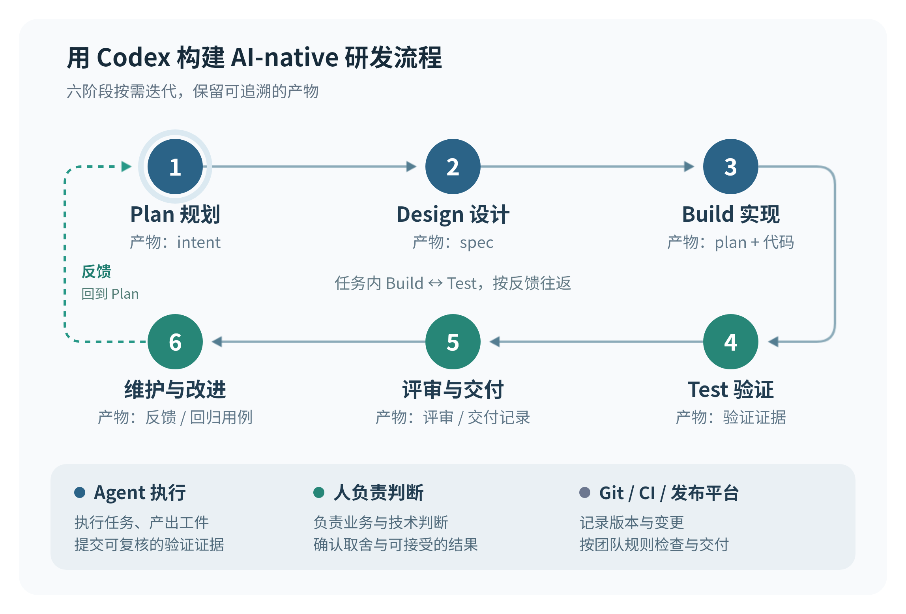

# 用 Codex 构建 AI-native 研发流程

从收到一个需求开始，带着 Codex 完成设计、开发、测试、上线和后续修复。

版本：2.1｜文字修订：2026-09-15｜技术资料核对：2026-09-14。以 Codex 桌面端为主，按需补充 CLI、IDE 和云端用法。

这份手册的结构参考了 [AGI Hunt 的微信文章](https://mp.weixin.qq.com/s/H7bu8QV6GrtqmZnkh0fRvQ)和 [Anthropic 原文](https://claude.com/blog/the-ai-native-sdlc-playbook)。产品操作参考官方说明，具体流程、提示词和案例由本文编写，并非官方发布的整套方案。

GitHub 整理日期：2026-09-22。内容对应[飞书文档](https://dcnb0h9s29sm.feishu.cn/docx/FxNadSuh6o1VPZxyOXMcWq1Anyc)第 119 版；本次整理仅适配 Markdown 排版。

**目录**

1. [概要：用 Codex 参与整个研发过程](#overview)
2. [开始前：准备练习项目](#getting-started)
3. [Plan：先把需求说清楚](#plan)
4. [Design：先看代码，再决定怎么改](#design)
5. [Build：按方案完成修改](#build)
6. [Test：实际运行并修正问题](#test)
7. [Review & Deliver：评审与交付](#review-deliver)
8. [Maintain & Improve：维护与改进](#maintain-improve)
9. [在团队里怎样开始使用](#team)
10. [来源与使用说明](#sources)

---


<a id="overview"></a>

## 1. 概要：用 Codex 参与整个研发过程

你让 Codex 写完一个功能，接着还要启动项目、检查页面、处理报错、请同事看代码，最后才能上线。如果每一步仍要你重新解释背景、搬运结果，写代码省下的时间，很快就会花在这些事情上。

本手册所说的 AI 原生 SDLC，就是让 Codex 从需求到维护都参与进来。你负责说明要解决的问题、决定重要取舍，并确认最终结果。Codex 根据需求读代码、提方案、做修改、运行检查，再根据反馈继续改。SDLC 指的就是软件从规划、开发到上线和维护的整个过程。

拿“给工单列表增加状态筛选”来说，你可以把现有项目和完成要求一起交给 Codex。让它检查搜索、分页和筛选怎样配合，完成修改，再实际打开页面、运行测试。你重点检查它是否理解了需求，以及最后的行为是否正确。

每做完一次，把值得保留的经验写进测试或项目说明。某种做法反复用得上，再整理成 Skill。下一次做类似功能，就能从这些已有积累开始。[Codex 最佳实践](https://learn.chatgpt.com/guides/best-practices)

### 1.1 与传统流程有什么区别

这里的传统流程，也包括已经使用 Git、自动测试和 CI/CD 的团队。引入 Codex 后，这些工具继续使用；主要变化在于，谁来执行日常步骤，以及执行结果怎样进入下一步。

| **阶段** | **常见的传统做法** | **使用 Codex 后可以怎样做** |
| --- | --- | --- |
| **Plan  <br/>规划** | 人整理反馈、写需求，再向开发者解释 | Codex 读材料、提出遗漏的问题、整理需求；你确定本次做什么 |
| **Design  <br/>设计** | 人查代码、比较方案，再交给实施者 | Codex 找出相关实现、比较可行方案；你决定影响较大的取舍 |
| **Build  <br/>实现** | 人修改代码、运行命令、协调多项工作 | Codex 按确认的需求连续修改和自检；你处理需要改变需求或方案的问题 |
| **Test  <br/>验证** | 人运行测试、看页面，再把问题交回开发 | Codex 运行检查、读报错、修复并重试；你检查有没有漏测重要行为 |
| **Review & Deliver  <br/>评审与交付** | 人整理改动、回答评审、准备发布信息 | Codex 审查和修改代码、准备 PR；团队按仓库规则批准合并和发布 |
| **Maintain & Improve  <br/>维护与改进** | 人查日志、找原因，再安排修复 | Codex 根据反馈和日志排查；团队把修复经验补进测试和工作说明 |

### 1.2 六个阶段，可以根据问题来回走

这六个阶段不必按顺序各做一次。写代码时发现测试失败，就在 Build 和 Test 之间来回修改；发现原方案有问题，就回到 Design。上线后的反馈，既可能变成新需求，也可能只需要一个小修复。

Plan 主要回答“为什么做、做到什么程度”。Build 中的实现计划则回答“改哪些文件、先做什么”。把这两个问题分清，就不会在需求还没确定时急着安排代码修改。

下图展示它们之间的关系。实际工作时，从你当前的问题开始；只有需要改变目标、方案或授权范围时，才重新讨论相关决定。



每个阶段都包含六部分：传统做法、AI 原生做法、流程、示例、治理和度量指标。“治理”说明谁负责决定、哪些操作需要限制；“度量指标”帮助团队判断做得是否更好。每章最后还会说明，做到什么程度才算完成。

---

<a id="getting-started"></a>

## 2. 开始前：准备一个可以练习的项目

### 2.1 贯穿案例：工单列表增加状态筛选

> [!NOTE]
> **这是为手册设计的练习案例。** 它不是某个真实项目的复盘，目前也没有完整开发、测试和部署的实操记录。下面的需求、故障和预期结果，用来解释每个阶段该怎样做。

假设你维护一个工单看板，已经有列表、关键词搜索和分页。使用者每天要从中找出尚未处理的事项，于是提出：“能不能只看待处理的工单？”我们给这项需求一个编号：TKT-017。

后文会围绕它讨论需求、设计方案、修改代码、测试和发布。到了维护阶段，再假设遇到一个问题：切换筛选后，旧请求返回的数据覆盖了新结果。小程序沿用同一个需求，只补充微信环境下不同的操作。

练习项目使用 Next.js App Router 和 TypeScript，把网页和简单 API 放在同一仓库。Vitest 检查查询逻辑，Playwright 检查浏览器里的操作。工单数据全部是虚构数据，不含个人信息；套用到真实项目时，要保留已有的登录权限、数据存储和访问限制。[Next.js 安装与项目准备](https://nextjs.org/docs/app/getting-started/installation)

没有现成项目，可以用下一节的提示词让 Codex 创建练习项目。有现成项目，则让它先找到相应文件和命令，再替换文中的路径。示例里的“预期结果”要由你实际运行后确认。

### 2.2 在桌面端打开项目

1. 在 Codex 桌面端**添加或打开项目目录**，选择本地执行。让它先报告项目路径、当前分支、尚未提交的修改和启动方法，确认没有打开错项目。
2. 如果已有项目，**先运行现有检查**。把原本就失败的项目记下来，后面才容易分辨哪些问题是本次修改引起的。
3. 如果从空目录开始，使用下面的提示词。确认列表、搜索和分页都能运行后，**保存一次 Git 提交**，作为后续修改的起点。
4. 同一个需求尽量**在同一条 Codex 任务里继续**。换目录、独立工作目录（worktree）或云环境后，重新确认依赖是否装好、服务怎样启动、测试怎样运行。

**提示词｜创建练习项目**

```text
在当前空目录建立一个可运行的工单看板练习项目。
采用 Next.js App Router、TypeScript、npm，使用合成数据。

先实现基线，暂不实现状态筛选：
- /tickets 显示编号、标题、状态；可按标题或编号搜索，每页 10 条。
- /api/tickets 接受 q、page，返回 items、total、page、pageSize。
- 提供 40 条固定数据：24 条 open、12 条 in_progress、4 条 closed。
- 使用 Vitest 验证查询逻辑，使用 Playwright 验证搜索和分页。
- 建立 lint、typecheck、test:ci、test:e2e、build、dev、start 脚本。
- Playwright 配置应能启动本地服务，说明浏览器依赖安装方法。
- 添加 package-lock.json、.gitignore、README 和简短 AGENTS.md。

检查现有文件，避免覆盖已有工作；若不是空目录，先解释如何适配。
完成后实际运行相关检查，报告路径、命令和结果。不要创建远端资源。
```

下面是本文使用的文件路径。你的项目可以不同，但 `README` 和发给 Codex 的提示词要写实际路径。

**目录示例｜本手册使用的文件路径**

```text
app/tickets/page.tsx             # 页面入口
app/api/tickets/route.ts         # 查询接口
lib/tickets.ts                  # 查询规则与合成数据
tests/tickets.test.ts            # 查询规则测试
e2e/tickets.spec.ts              # 浏览器行为测试
scripts/verify.sh                # 本地与 CI 共用的检查入口
AGENTS.md                       # 仓库长期工作约定
docs/work/TKT-017/               # 本次需求、方案、计划、证据
```

### 2.3 准备 Web 和小程序的交付环境

| **环节** | **本文使用** | **开始前确认什么** |
| --- | --- | --- |
| **开发** | Codex 桌面端、本地 Git 项目 | 页面能打开，API 能访问，测试能运行 |
| **代码托管** | GitHub | 能推送代码和创建合并请求（PR）；有人负责维护主分支规则 |
| **自动检查（CI）** | GitHub Actions | 能在新环境中安装依赖并运行检查 |
| **Web 预览与上线** | Vercel Git 集成 | 已连接仓库，知道哪个分支用于正式发布，能找到部署记录 |
| **小程序选读** | 微信开发者工具、微信公众平台 | 有 AppID 和开发者权限；使用预览、上传脚本时还需代码上传密钥 |

Web 主线采用一种常见方式：功能分支用于预览，生产分支用于正式发布。Vercel 的套餐会影响团队协作和私有组织仓库的使用。按你的仓库和团队情况确认套餐，个人练习和团队项目可能不同。[Vercel Git 集成](https://vercel.com/docs/git) [Hobby 使用范围](https://vercel.com/docs/plans/hobby)

首次接入 Vercel 时，新建项目并导入 GitHub 仓库。检查根目录、Next.js 框架设置、构建命令和 Node 版本。本文 CI 使用 Node 22，Vercel 中也应设置相同版本。

确认生产分支为 main，先发布现有功能，打开正式地址检查一次。再开始修改筛选功能。这样，后面既能比较新旧行为，也能找到上一次正常发布的版本。

**小程序补充。**  
 先用同一组虚构数据练习页面。接入普通 HTTPS API 时，还要在微信后台配置服务器域名，并关闭调试时的“跳过域名校验”，在真机上测试网络。网页能访问 API，不代表小程序也一定能访问。[微信网络与域名配置](https://developers.weixin.qq.com/miniprogram/dev/framework/ability/network.html)

代码上传密钥放在本机受限文件或 CI 的凭证存储中。不要写进仓库，也不要贴进示例提示词。

---

<a id="plan"></a>

## 3. Plan：先把需求说清楚

你收到的是一句“只看待处理工单”。先弄清楚使用者想解决什么问题，以及哪些行为需要保留，再考虑控件和代码。

### 3.1 传统做法

产品或开发者询问使用场景，写下需求，再交给工程实施。如果工单只写“增加状态筛选”，开发者就得自己补全细节：搜索词要不要保留？切换状态后要不要回到第一页？

### 3.2 AI 原生做法

让 Codex 先看现有页面和接口，帮你找出这些需要回答的问题。你决定业务规则，它把讨论结果整理成需求说明。如果材料在飞书或工单系统里，可以通过已授权的连接器、MCP 或文件交给它，并注明材料的来源和版本。[MCP 与外部上下文](https://learn.chatgpt.com/docs/extend/mcp)

### 3.3 流程

1. 把使用者的**原话、现有功能和遇到的困难**告诉 Codex。需求比较复杂时，可以先用输入框里的计划模式讨论。
2. 让它**读取列表、查询接口和测试**，说明哪些功能已经有了，哪些需要新增，哪些还不能确定。
3. **回答影响范围的问题**：支持哪些状态？筛选能否和搜索一起用？是否允许编辑工单？本次只做 Web，还是也做小程序？
4. 让它把结果写入 `docs/work/TKT-017/intent.md`。**用 R1、R2 等编号列出验收标准**，方便后面逐条检查。
5. 读一遍需求：**每条能不能通过操作或测试判断对错**？把本次不做的内容写清楚。确认这个版本后，再进入设计。

### 3.4 示例

可以这样开始讨论：

**提示词｜澄清需求**

```text
使用者希望工单列表可以“只看待处理”。
请先读取现有 /tickets 页面、查询接口和测试，和我澄清需求。
关注搜索、分页、刷新、无结果与请求失败的行为。
区分事实、假设和待确认问题，不自行增加批量处理或状态编辑。

形成 docs/work/TKT-017/intent.md：
问题、目标、范围、非目标、R1—R4 验收标准、未决问题。
本轮只完成需求澄清，不修改产品代码。
```

例如，Codex 问：“切换状态时保留搜索词吗？”你回答：“保留，但回到第一页。”让它把这句话写进需求，后面的页面、接口和测试都按同一条规则处理。

练习中的需求说明可以写成这样：

**文件模板｜`intent.md`**

```markdown
# TKT-017：工单状态筛选

目标：使用者能直接找到某类状态下与关键词匹配的工单。
范围：Web 工单列表；小程序复用同样查询规则作为补充实践。
非目标：不修改工单状态，不新增真实用户鉴权，不改造存储系统。

R1：可选择全部、待处理、处理中、已关闭；列表记录与选择一致。
R2：状态和关键词共同生效；先筛选后分页，总数是筛选后的总数。
R3：切换状态保留关键词并回到第一页；Web 刷新恢复 URL 中的条件。
R4：加载中、没有匹配记录、请求失败分别呈现；失败后可以重试。

待设计：非法状态参数如何处理；现有分页和 URL 状态怎样复用。
负责人角色：需求负责人。
接受记录：链接到实际确认此版本的工单、评论或提交记录。
```

### 3.5 治理

本次做什么、规则是什么，由需求负责人决定。Codex 负责提问和整理，不能自行把一条尚未确认的要求标成“已接受”。

只想让它读材料时，使用只读权限；允许它写需求文件时，再开放相应写入权限。提示词说“只读”和工具实际能做什么，要保持一致。

### 3.6 度量指标

| **看什么** | **怎么算** | **去哪里找** |
| --- | --- | --- |
| **需求讨论是否更快** | 从开始澄清到负责人确认需求，用了多久 | 工单时间和确认记录 |
| **需求是否更清楚** | 同期交付的需求中，有多少因理解错误而重开 | 工单重开原因；正常新增需求另算 |

> **这一阶段完成的标志：** R1—R4 都能检查，负责人确认了本次范围。下一步使用确认后的 `intent.md`，并继续解决里面尚未确定的设计问题。小修改可以把这些信息直接写在工单里。

---

<a id="design"></a>

## 4. Design：先看现有代码，再决定怎么改

现在需求明确了：筛选要和搜索、分页一起工作。把确认后的需求和现有项目交给 Codex，让它先找出相关实现，再讨论修改方案。

### 4.1 传统做法

工程师阅读代码、比较方案，再安排接口、页面和测试的修改。设计说明需要把细节讲清楚，比如后端返回的总数是全部工单数，还是筛选后的工单数。

### 4.2 AI 原生做法

让 Codex 先找出可以复用的代码，再提出改动较少、又能满足需求的方案。你检查重要取舍。读代码还不能确定的事，就让它做一个小实验，说明测了什么、看到了什么，再决定怎样实现。

### 4.3 流程

1. 给 Codex `intent.md`，让它**找出页面、查询函数、分页逻辑和测试文件**，报告具体路径。
2. 让它**比较可行方案**。本例至少要说清：在服务端筛选所有数据，与只筛选当前页的数据，结果有什么不同。
3. 约定接口接收哪些参数、返回哪些字段，页面怎样显示加载、空结果和错误。**逐条检查方案能否满足 R1—R4**。
4. **有疑问就运行小实验**。例如用一组跨多页的数据，观察“先分页再筛选”是否漏掉其他页的匹配记录。
5. **把方案和选择理由写入**`docs/work/TKT-017/spec.md`。需求负责人确认页面行为，技术负责人确认接口和主要实现方式。
6. 如果还做小程序，补充页面如何读取 status 和 q、**切换筛选时如何回到第一页**。Web 的刷新恢复条件，在小程序里对应重新进入页面时恢复参数。

### 4.4 示例

让 Codex 先写方案：

**提示词｜起草设计方案**

```text
读取 TKT-017/intent.md 和工单列表的真实实现。
起草 spec.md，包含：
- 现有实现位置及证据。
- 最小方案、备选方案和选择理由。
- status/q/page 参数，返回 items/total/page/pageSize 的含义。
- 正常、空结果、非法参数、网络失败及重试行为。
- R1—R4 对应的实现与验证位置。
不确定的行为先验证，不把猜测写成现状；本轮不实施完整功能。
```

本例可以采用以下约定：

| **项目** | **约定** |
| --- | --- |
| **接口** | GET /api/tickets?status=open&q=登录&page=1 |
| **status** | all、open、in_progress、closed；不传时按 all 处理，非法值返回 400 |
| **q 与 page** | q 继续按标题或编号搜索；page 必须是正整数，不传时为 1，非法值返回 400 |
| **查询顺序** | 先按状态和关键词筛选，再计算 total，最后按现有顺序分页；每页 10 条 |
| **页面状态** | 切换状态时保留 q，把 page 改成 1；Web 地址中的条件与页面选择一致 |
| **无结果与失败** | 请求成功且 total 为 0 时显示“无匹配记录”；请求失败时显示错误和重试入口 |
| **本轮不改** | 工单编辑、真实鉴权、存储方式和已有排序规则 |

为什么不只筛选当前页？因为匹配的工单可能在后几页，那样会漏掉数据，不符合 R2。把理由写进 `spec.md`，后续实施和评审时就有共同依据。

**小程序补充。**  
 可以接着说：“在 `spec.md` 中说明小程序页面怎样调用同一套查询规则。先用相同测试数据验证交互，再列出接入真实 API 需要配置的域名和权限。”小程序需要自己的页面和数据调用代码，不能直接把网页组件搬过去。

### 4.5 治理

会改变接口兼容性、用户权限或整体架构的决定，由对应负责人确认。方案确定后，Codex 可以自行处理其中的一般实现细节。

实验能说明什么，也要写清楚。虚构数据上的查询实验，只能证明这组输入下的行为；开发者工具里能打开页面，也不能代替真机网络测试。

### 4.6 度量指标

| **看什么** | **怎么算** | **去哪里找** |
| --- | --- | --- |
| **设计疑问是否解决** | 评审时列出的关键问题中，有多少已经得到代码、实验或负责人确认 | `spec.md` 的问题与结论 |
| **方案是否减少返工** | 开发开始后，有多少任务因设计遗漏而返工 | 工单和 PR 中记录的返工原因 |

> **这一阶段完成的标志：** 按照 `spec.md`，就知道改哪里、接口怎样用、页面该怎样表现。会阻碍实施的问题已经解决。把确认后的方案和必要的实验记录交给 Build。

---

<a id="build"></a>

## 5. Build：让 Codex 按方案完成修改

需求和设计已经确认，可以开始写代码了。接下来先准备好运行环境，再把相关文件和检查命令交给 Codex，让它完成整个筛选功能。

### 5.1 传统做法

开发者修改接口和页面，运行测试，再处理报错。几项工作同时进行时，还要协调分支、依赖和本地服务。换一个工作目录，可能又要重新安装和配置。

### 5.2 AI 原生做法

你提供需求、方案和能运行的项目，让 Codex 自己安排修改顺序，边做边检查。仓库长期遵守的规则放在 `AGENTS.md`，这次需求的细节放在对应文件里。这样，它能找到需要的信息，你也不用每次从头解释。[AGENTS.md 工作方式](https://learn.chatgpt.com/docs/agent-configuration/agents-md)

### 5.3 流程

1. **选择在哪里做。**  
   首次练习可以选择桌面端的 Local，直接使用本地项目。如果你正在本地调试另一项工作，可以为新任务选择 Worktree，并说明从哪个分支开始。
2. **准备运行环境。**  
   在 Local environments 中设置新 worktree 的初始化脚本，例如运行 `npm ci` 安装锁文件里的依赖。常用的启动和检查命令可以设为项目 Actions。检查新目录的端口和测试数据是否可用。[本地环境配置](https://learn.chatgpt.com/docs/environments/local-environment)
3. **让它先读说明。**  
   给出 `AGENTS.md`、`intent.md`、`spec.md` 和相关代码。让它确认项目当前能否运行、哪些文件已有未提交修改。
4. **先看实现计划。**  
   本例涉及接口、页面和地址参数，可以先用计划模式讨论改哪些文件、按什么顺序改、怎样检查。确认后保存到 `plan.md`，再开始实施。已经定位的微小修复，可以直接说明范围和完成要求。[规划复杂任务](https://learn.chatgpt.com/guides/best-practices#plan-first-for-difficult-tasks)
5. **让它连续做下去。**  
   先改查询规则和测试，再接接口与页面，最后检查组合行为。一般实现细节由 Codex 处理；如果必须改变已确认的需求或接口，再交给你决定。
6. **需要时再拆开做。**  
   可以在不同 worktree 中处理独立任务，也可以把范围清楚的探索或检查交给子代理。前后端要一起修改时，先定好接口，再安排并行工作。
7. **查看实际结果。**  
   看完整代码改动、运行结果和还没测的部分。如果要回到常用本地目录体验，可以通过 Handoff 把任务和修改接回 Local，再检查依赖与配置。[Worktree 与 Handoff](https://learn.chatgpt.com/docs/environments/git-worktrees)

### 5.4 示例

下面是一份简短的 `AGENTS.md`。里面的命令应在第二章准备项目时建立，并确认可以运行。

**文件模板｜`AGENTS.md`**

```markdown
# AGENTS.md

## 项目与任务
- 工单查询位于 lib/tickets.ts，页面和 API 使用相同查询规则。
- 本次范围从 docs/work/<工作项>/ 中读取，不从旧聊天推测需求。
- 保留已有未提交修改；出现无关变更时先说明来源。

## 运行与验证
- 安装：npm ci；启动：npm run dev。
- 静态、单元测试和构建：bash scripts/verify.sh。
- 浏览器测试：npm run test:e2e；配置负责启动测试服务。
- 修复失败时保留有效断言，不用跳过测试掩盖问题。
- 完成报告包含实际命令、结果、未验证项，以及对应代码版本。

## Code Review Rules
- 查询必须先过滤后分页，total 是过滤后的总数。
- 筛选条件与页面数据应一致，检查页码和异步响应是否保留旧状态。
- 用户可见的请求失败不能伪装为成功的空列表。
```

准备好后，把实现任务交给 Codex：

**提示词｜开始实现**

```text
读取 TKT-017 的 intent.md、spec.md 和适用 AGENTS.md。
先检查基线，给出实现计划：改动文件、工作顺序、验证与主要风险。
计划接受后，完成状态筛选的查询逻辑、接口、页面和测试。
使用现有依赖与约定；不要改造无关模块或编辑工单功能。

在本次范围内连续推进并运行检查，遇到失败先定位再修正。
如果必须改变已接受的接口或需求，说明影响并等待该决定。
结束时报告 R1—R4 的实现情况、实际验证结果和未完成项。
```

你看到的计划可以很短：“先给 `queryTickets` 增加 status 条件，测试跨页筛选；再接入 API 和页面；切换状态时保留 q、重置 page；最后检查刷新和错误重试。”阅读时重点看有没有遗漏需求，或者安排了本次不需要的修改。

如果要另开任务补充使用说明，可以说：“按同一个 spec 版本，在独立 worktree 中补充文档示例。只修改 docs，不改接口，由主任务合并并检查。”worktree 可以分开文件修改；共用的端口、数据库和外部账号，仍需要另外安排。

**小程序补充。**  
 在 `miniprogram/` 中建立小程序页面和数据调用代码，使用同一组状态和测试数据。先让 Codex 说明怎样用开发者工具打开项目，再逐步加入筛选和分页。Web 与小程序分别记录测试结果。

**云端补充。**  
 在 Codex cloud 中连接仓库，选择起始分支，配置环境初始化，再提交同样的需求和验收要求。先确认云端能安装依赖、运行测试。任务完成后，查看代码差异（diff）和测试记录，再继续评审。[云环境准备](https://learn.chatgpt.com/docs/environments/cloud-environment)

CLI 和 IDE 用户可以在准备好的本地仓库使用同样的说明和命令。云环境需要单独准备，本机正在运行的服务不会自动带过去。

### 5.5 治理

`AGENTS.md` 告诉 Codex 应当怎样工作。沙箱限制命令能访问哪些文件和网络，审批设置决定什么时候要额外授权。它们各有作用，不能只靠提示词限制工具权限。[Codex 沙箱与审批](https://learn.chatgpt.com/docs/sandboxing)

给 Codex 足够的权限完成常规修改和测试。扩大访问范围、推送、合并和发布，则按项目已经确定的授权执行。检查它的完成报告时，要看实际运行结果；计划里写了“将运行测试”，不代表已经运行。

复杂任务可以持续更新 `plan.md`，方便你知道做到哪一步。这些文件名和格式是本文的建议，简单任务不需要照搬整套文件。[官方工作流示例](https://developers.openai.com/cookbook/examples/codex/iterating-development-workflows-with-codex)

### 5.6 度量指标

| **看什么** | **怎么算** | **去哪里找** |
| --- | --- | --- |
| **多久能看到可运行功能** | 从开始开发到第一个能运行、能检查的版本，用了多久 | 任务开始时间和首次完整检查记录 |
| **还需要多少人工修正** | 因实现错误改了几轮，人实际接手处理了多久 | PR 修改原因和简短工时记录 |

> **这一阶段完成的标志：** 修改已经写进项目，必要测试已经补上，重要决定有记录。把当前代码版本、改动说明、初步测试结果和还没测的部分交给 Test。

---

<a id="test"></a>

## 6. Test：实际运行，发现问题后继续改

假设筛选功能已经写好。你在第一页选“已关闭”，看到了四条记录。接下来还要试：从第三页切换会怎样？带着搜索词切换会怎样？刷新和断网后是否正常？

### 6.1 传统做法

开发者、测试人员和 CI 分别运行检查。发现问题后，把报错和操作步骤交回开发者；修复后再检查一次。每次反馈都需要有人整理和传递。

### 6.2 AI 原生做法

让 Codex 自己运行测试、读取报错、修改代码，再运行同一项检查。你重点看测试是否覆盖了需求，以及报告里的结果是否真的执行过。页面功能还要检查实际交互；Codex 没有可用浏览器工具时，就明确记录由谁补做这部分检查。[测试与评审实践](https://learn.chatgpt.com/guides/best-practices#improve-reliability-with-testing-and-review)

### 6.3 流程

1. 对照 R1—R4，**列出每条怎样检查**：查询逻辑用什么测试，页面要做哪些操作，哪些需要人工确认。
2. **把常用检查放进同一个脚本**，本地和 CI 都调用它。某一步失败时，脚本应返回错误，让后续步骤知道检查没有通过。
3. **让 Codex 运行检查**。报错后，先判断是产品代码、测试代码还是环境出了问题，再修改。不要靠删断言、跳过测试或盲目延长等待来消除报错。
4. **打开实际页面**，测试第三页切换、搜索组合、刷新和断网后重试。记录地址、代码版本和看到的结果。
5. 对能稳定重现的问题，**先写一个会失败的测试**，再修代码，确认同一个测试变成通过。如果测试预期本身错了，先说明正确行为再改测试。
6. 把结果写入 `verification.md`，**分别标明通过、失败和未执行**。代码问题继续回到 Build；需求或方案不清楚，就回到 Plan 或 Design。
7. 如果做小程序，**再用开发者工具和真机检查**。确认 AppID 和环境，测试筛选、翻页、重新进入页面、断网重试，并用有权限的微信账号扫码预览。[微信预览与协作](https://developers.weixin.qq.com/miniprogram/dev/framework/quickstart/release.html)

### 6.4 示例

先建立统一检查命令。把下面内容保存为 `scripts/verify.sh`。它会依次执行代码检查、类型检查、单元测试和构建，任何一步失败都会停止。

`package.json` 中要先有 `lint`、`typecheck`、`test:ci`、`build` 四个脚本。其中 `test:ci` 应运行一次后退出，不能停留在持续监听模式。

**脚本｜`scripts/verify.sh`**

```bash
#!/usr/bin/env bash
set -euo pipefail

npm run lint
npm run typecheck
npm run test:ci
npm run build

printf '%s\n' 'VERIFICATION_OK'
```

再准备浏览器测试。下面的 `playwright.config.ts` 会启动构建后的应用。先运行 verify.sh 生成构建，再运行 `npm run test:e2e`。[Playwright 配置说明](https://playwright.dev/docs/test-configuration)

配置使用 3000 端口。如果端口已被占用，要一起修改启动命令、url 和 `baseURL` 中的端口，避免连到另一个任务的服务。

**配置｜`playwright.config.ts`**

```javascript
import { defineConfig } from '@playwright/test';

export default defineConfig({
  testDir: './e2e',
  forbidOnly: Boolean(process.env.CI),
  use: {
    baseURL: 'http://127.0.0.1:3000',
    browserName: 'chromium',
    trace: 'retain-on-failure',
  },
  webServer: {
    command: 'npm run start -- --hostname 127.0.0.1 --port 3000',
    url: 'http://127.0.0.1:3000/tickets',
    reuseExistingServer: false,
    timeout: 120000,
  },
});
```

下面的 `e2e/tickets.spec.ts` 检查一条具体行为：先打开第三页，再选“已关闭”，应该回到第一页，看到四条已关闭工单，总数也是四条。

测试要求状态选择框有“工单状态”这个可访问名称，页面总数文字为“共 4 条”。这只是一个用例，还要补齐 R1—R4 的其他检查。

**测试示例｜`e2e/tickets.spec.ts`**

```javascript
import { test, expect } from '@playwright/test';

test('切换状态回到第一页，并展示筛选后的总数', async ({ page }) => {
  await page.goto('/tickets?page=3');
  await page.getByLabel('工单状态').selectOption('closed');
  await expect(page).toHaveURL(/status=closed/);
  await expect(page.getByText('共 4 条', { exact: true })).toBeVisible();
  const url = new URL(page.url());
  expect(url.searchParams.get('page') ?? '1').toBe('1');
  await expect(page.getByRole('cell', {
    name: '已关闭', exact: true,
  })).toHaveCount(4);
});
```

让 Codex 执行并处理测试结果：

**提示词｜执行验证并处理失败**

```text
对照 TKT-017 的 R1—R4 验证当前实现。
先运行 bash scripts/verify.sh，再运行 npm run test:e2e。
检查跨页筛选、关键词组合、刷新恢复、空结果和失败后重试。
通过可用的浏览器工具查看实际界面，并复核交互；工具缺失要说明。

发现失败后先报告触发条件和原因，在已确认范围内修正并重跑。
将实际命令、执行时间、代码版本、结果和未验证项写入 verification.md。
不要把预期输出、静态阅读或环境报错写成测试通过。
```

**结果怎样记录。** 下面先填“待执行”。实际运行后，再填结果，并附上能打开的测试报告或日志。

| **验收项** | **要检查什么** | **结果** |
| --- | --- | --- |
| **R1 / R2** | 跨页筛选、关键词组合、total；附查询测试日志 | 待执行 |
| **R3** | 第三页切换状态、刷新恢复条件；附浏览器报告 | 待执行 |
| **R4** | 空结果、请求失败、重试；附浏览器报告 | 待执行 |
| **小程序选读** | 开发者工具与基础库版本、手机系统、客户端版本、操作结果 | 未选择 / 待执行 |

**小程序补充。**  
 报问题时，说明“用哪个版本、怎样进入页面、做了什么、预期是什么、实际是什么”。Web 浏览器测试不能覆盖微信里的运行情况，还需要开发者工具、真机或适用的自动化工具来检查。

### 6.5 治理

需求和技术负责人先确认什么结果算正确，再让 Codex 执行检查。失败的检查要有处理结果；因为环境问题没能运行的，继续标为“未执行”。

也要评审测试和 CI 本身的修改。重点看有没有删掉关键断言、跳过重要场景，或者让失败的命令不再返回错误。

修改 `AGENTS.md`、Skill 或模型配置后，可以挑几项熟悉的历史任务再做一次。比较结果是否正确、是否真的运行了检查，以及人还需要修正多少次。先用少量任务检查新方法是否可靠，再扩大使用。

### 6.6 度量指标

| **看什么** | **怎么算** | **去哪里找** |
| --- | --- | --- |
| **失败后修得有多快** | 从首次稳定复现，到修复后通过同一检查，用了多久 | 测试和代码修改记录 |
| **重要问题是否漏测** | 同期交付的任务中，上线后发现了多少本应在验收时发现的缺陷 | 缺陷复盘，对应到 R 编号 |

> **这一阶段完成的标志：** 约定的检查已经执行并通过。没能执行的部分，已说明原因、由谁补做或谁决定接受风险。把当前代码版本和测试记录交给评审者。

---

<a id="review-deliver"></a>

## 7. Review & Deliver：检查完整改动，再发布给用户

本地测试通过后，还需要请人看代码、检查预览版本，再正式发布。最后要确认，用户打开的是本次发布的版本，功能也确实正常。

### 7.1 传统做法

开发者整理 PR、回答评审意见、准备发布说明。评审者要了解完整改动，发布者要确认发哪个版本。代码继续修改后，相关检查也需要重跑。

### 7.2 AI 原生做法

让 Codex 检查完整改动，处理具体评审意见，并整理 PR 和发布说明。团队在 GitHub 中确认检查和批准情况，在 Vercel 或微信后台确认发布结果。始终核对版本：测试通过的代码，与准备发布的代码是否一致。

### 7.3 流程

1. **查看整个功能的改动。**  
   在桌面评审面板中，选择相对目标分支的差异。有未提交修改时也一起检查。Last turn 只显示最近一轮，检查整个功能时不要只看它。
2. **让 Codex 评审并修正。**  
   使用 `/review` 选择分支或未提交改动。读到具体问题后，可以在对应代码行评论，再发送修复请求。修改后重跑相关检查。[代码评审用法](https://learn.chatgpt.com/docs/code-review)
3. **创建 PR，运行 CI。**  
   用桌面 Git 控件或已授权命令提交、推送代码并创建 PR。写清用户会看到什么变化、测过什么、还有什么限制。让 GitHub Actions 在新环境中执行检查。
4. **打开预览版本。**  
   Vercel 连接仓库后，会为非生产分支创建预览。打开本次提交对应的地址，试一次关键操作。代码更新后，要检查新预览。[Vercel 分支预览与部署](https://vercel.com/docs/git)
5. **确认后合并。**  
   本文采用“人工合并后自动发布”的方式。主分支要求通过 PR、必要检查和团队评审，避免未检查的修改直接上线。个人练习时记录自检决定；团队项目由规定角色批准。
6. **检查正式地址。**  
   合并触发 Vercel 生产部署后，先核对部署的提交，再测试筛选、搜索组合和错误重试。记录发布版本、时间，以及出问题时准备恢复到哪个版本。
7. **小程序按自己的流程发布。**  
   上传开发版后，在后台设置体验版，让体验成员真机验收。之后提交审核；审核通过后，由有权限的人发布，再检查线上版本。[微信版本与发布](https://developers.weixin.qq.com/miniprogram/dev/framework/quickstart/release.html)

### 7.4 示例

**示例 A：先评审，再给出明确的修复要求。**  

**提示词｜评审完整改动**

```text
审查 TKT-017 相对目标分支的完整变更，以及未提交修改。
读取 intent.md、spec.md 和 verification.md。
重点检查过滤与分页顺序、总数、URL 状态、错误重试、旧请求覆盖。
对每个问题给出代码位置、触发条件和影响；区分证实的问题与疑点。
本轮只报告发现。
```

例如，你在 diff 上发现 total 是筛选前计算的，可以评论：“这里的总数包含了不匹配的工单，与 R2 不一致。”再发送：“修复这条意见，补一个只有少量匹配工单的测试，然后重跑相关检查。”

如果想在 GitHub 上调用 Codex 评审，需要先连接该仓库的 Codex cloud，并开启 Code review，再在 PR 评论中输入 `@codex review`。具备相应权限时，也可以让它启动修复任务。这是单独配置的云端用法，桌面端登录后不会自动启用。[Codex GitHub 评审](https://learn.chatgpt.com/docs/third-party/github)

**示例 B：让每个 PR 自动运行检查。**  
 把下面内容保存为 `.github/workflows/ci.yml`。使用前，先确认第二章的脚本和锁文件、第六章的 Playwright 配置都能运行。Node 版本要与本地和 Vercel 一致。Action 参数参照官方用法：[checkout](https://github.com/actions/checkout)、[setup-node](https://github.com/actions/setup-node)。

**配置｜`.github/workflows/ci.yml`**

```yaml
name: CI
on:
  pull_request:
  push:
    branches: [main]

permissions:
  contents: read

jobs:
  web-checks:
    runs-on: ubuntu-latest
    timeout-minutes: 15
    steps:
      - uses: actions/checkout@v7
        with:
          persist-credentials: false
      - uses: actions/setup-node@v7
        with:
          node-version: '22'
          cache: npm
      - run: npm ci
      - run: bash scripts/verify.sh
      - run: npx playwright install --with-deps chromium
      - run: npm run test:e2e
```

先提交一次真实 PR，观察 CI 是否正常运行。然后由管理员把这个检查设为主分支的必需检查。只有这样，检查失败才会阻止合并。正式项目还应按团队规则固定经过核验的 Action 提交版本。[GitHub 分支保护](https://docs.github.com/en/repositories/configuring-branches-and-merges-in-your-repository/managing-protected-branches/about-protected-branches)

本文由 GitHub Actions 负责检查，Vercel Git 集成负责部署。如果团队要求合并后再单独批准发布，就要把生产发布放到受审批保护的任务里，并关闭会绕过它的自动发布路径。只创建一个 GitHub environment，不会限制另一条 Vercel 自动部署路径。[GitHub 部署环境](https://docs.github.com/en/actions/concepts/workflows-and-actions/deployment-environments)

**示例 C：生成小程序预览，再上传开发版。**  
 先在微信开发者工具中打开 `miniprogram/`，检查 `project.config.json` 和 AppID，手动预览一次。然后在微信后台的开发设置中取得代码上传密钥，按实际情况配置上传 IP 白名单。[miniprogram-ci 官方说明](https://developers.weixin.qq.com/miniprogram/dev/devtools/ci.html)

在仓库中安装并锁定 miniprogram-ci 开发依赖，把下面脚本保存为 `scripts/miniprogram.cjs`。运行时位于仓库根目录。它只负责预览和上传，审核、正式发布仍需后续操作。

**脚本｜`scripts/miniprogram.cjs`**

```javascript
const fs = require('node:fs');
const path = require('node:path');
const ci = require('miniprogram-ci');

async function main() {
  const mode = process.argv[2];
  if (!['preview', 'upload'].includes(mode)) {
    throw new Error('Usage: node scripts/miniprogram.cjs preview|upload');
  }
  const appid = process.env.WX_APPID;
  const privateKeyPath = process.env.WX_UPLOAD_KEY_PATH;
  if (!appid || !privateKeyPath) throw new Error('Missing WeChat configuration');
  fs.accessSync(privateKeyPath, fs.constants.R_OK);
  const project = new ci.Project({
    appid,
    type: 'miniProgram',
    projectPath: path.resolve('miniprogram'),
    privateKeyPath,
    ignores: ['node_modules/**/*'],
  });
  const common = {
    project,
    desc: 'TKT-017 工单筛选',
    setting: { es6: true, minify: true },
    robot: 1,
  };
  if (mode === 'preview') {
    fs.mkdirSync('artifacts', { recursive: true });
    await ci.preview({
      ...common,
      qrcodeFormat: 'image',
      qrcodeOutputDest: path.resolve('artifacts/miniprogram-preview.jpg'),
    });
    console.log('Preview QR: artifacts/miniprogram-preview.jpg');
  } else {
    const version = process.env.WX_VERSION;
    if (!version) throw new Error('Set WX_VERSION before upload');
    await ci.upload({ ...common, version });
    console.log('Uploaded development version:', version);
  }
}

main().catch((error) => {
  console.error(error.message);
  process.exitCode = 1;
});
```

预览时，先配置 `WX_APPID` 和 `WX_UPLOAD_KEY_PATH`，再执行 `node scripts/miniprogram.cjs preview`。脚本生成二维码后，用有权限的微信账号扫码，在真机上检查功能。

准备上传时，设置 `WX_VERSION`，再执行 `node scripts/miniprogram.cjs upload`。记下版本号、commit SHA 和上传时间。如果项目需要小程序 npm 构建或 TypeScript 预编译，应先完成这些步骤，让 `projectPath` 指向能完整上传的项目。

上传成功后，到微信公众平台的“版本管理”找到开发版，设置体验版并验收。确认后提交审核，按实际审核意见处理。审核通过后，由有发布权限的人发布，再用线上入口检查。预览二维码、体验版和线上版分别对应不同版本。

**发布记录要让接手的人找得到结果。** 记录需求编号、PR、代码版本、测试报告、批准记录、预览地址、正式版本、线上检查结果，以及出问题时恢复到哪里。小程序再补上 AppID、体验版版本和审核状态，按后台实际显示填写。

### 7.5 治理

Codex 可以准备材料和修正代码。仓库负责人维护合并规则，发布负责人决定正式上线。`AGENTS.md` 和 Skills 告诉 Codex 怎样工作；必需检查和发布批准，应由 GitHub、CI 和发布平台落实。

确认每次批准和测试都对应当前代码。代码又改过，就重跑受影响的检查。不能只凭 Codex 说“已经通过”就发布，要能找到对应的 CI 或平台记录。

小程序上传密钥只提供给可信的运行环境和人员。不要让未经审核的外部 PR 读取密钥。微信平台审核需要实际完成，Codex 可以帮助理解和处理反馈，不能替代审核结果。

### 7.6 度量指标

| **看什么** | **怎么算** | **去哪里找** |
| --- | --- | --- |
| **评审和发布等待多久** | PR 准备好到首次有效评审、验收通过到正式可用，分别用了多久 | PR 与发布记录；小程序审核等待单独统计 |
| **发布是否稳定** | 需要回退或紧急修复的发布次数，占同期发布次数的比例 | 发布记录和相关事故 |

> **这一阶段完成的标志：** 正式发布的是批准过的版本，线上关键操作已经检查，值守人员知道出问题时怎样恢复。如果还在上传、体验或审核，就如实记录当前进度。

---

<a id="maintain-improve"></a>

## 8. Maintain & Improve：解决线上问题，让下次少出同样的错

假设筛选功能上线后，有人反馈：“我在第三页点了已关闭，列表先显示正确，过一会儿又跳回旧数据。”接下来要查清原因、修复问题，也要看看为什么之前没有测出来。

### 8.1 传统做法

值守人员读用户反馈、查日志和提交记录，再找熟悉代码的人处理。修复后，如果排查过程只留在聊天中，下次遇到同类问题还得重新找线索。

### 8.2 AI 原生做法

把用户反馈、复现步骤、出问题的版本和相关日志交给 Codex，先让它查原因。要求它说明哪些已经确认，哪些只是猜测，再尝试复现。修复后走正常评审和发布流程，并把这次漏掉的情况补进测试。

### 8.3 流程

1. **记下问题发生的条件。**  
   包括客户端、时间、页面地址或参数、部署版本，以及用户按什么顺序操作。缺少的信息先标为未知。
2. **判断是否先恢复旧版本。**  
   如果影响严重，由发布负责人选择此前验证过的版本。Web 按部署平台操作，小程序则查看微信后台可用的恢复方式。
3. **先查原因。**  
   让 Codex 对照代码改动、日志和页面实现排查。本例重点检查：切换前发出的旧请求，是否在新请求之后返回，并把页面数据覆盖了。
4. **写出能复现的测试。**  
   让第三页的旧请求晚一点返回，再切换到“已关闭”。观察旧实现是否会把不匹配的数据重新显示出来。
5. **修复并重新交付。**  
   在修复分支中修改已确认的问题，重跑这个用例和原有检查。完成评审、预览验收、正式发布，再检查线上行为。
6. **补上漏掉的检查。**  
   如果之前只测试请求按顺序返回，就补上返回顺序交错的情况。如果 Codex 经常遗漏这一类问题，再更新项目说明或评审 Skill。
7. **重复工作再考虑定时执行。**  
   例如先手动跑通“检查最近的 CI 失败并分析原因”，确认有用后再设定时任务。保存已经处理的运行 ID，避免重复报告。[定时任务的建立与验证](https://learn.chatgpt.com/docs/automations)

### 8.4 示例

**示例 A：先判断为什么出错。**  
 下面的故障是教学情境。实际使用时，需要换成真实反馈，并通过代码和复现确认原因。

**提示词｜排查线上问题**

```text
反馈：工单列表在第三页切换到“已关闭”后，短暂正确，随后显示旧数据。
请读取发布记录、相关 diff 和查询状态管理代码。

先诊断，不修改产品代码：
1. 列出已知事实、可能原因、缺少的信息。
2. 提出能区分“未重置页码”和“旧请求覆盖”的复现方法。
3. 说明最小修复范围、验证方式与是否需要先恢复旧版本。
仅将诊断写入 docs/incidents/TKT-017-filter-race.md。
当前只准备诊断与方案，不操作生产环境。
```

原因确认后，再继续：“补一个能控制请求返回顺序的失败用例。修改代码，只让最新查询的结果更新页面。修复后重跑这个用例和 R1—R4，记录实际结果。”这样能确认修复解决了原因，而不只是暂时看不出问题。

**恢复旧版本后，也要检查正式地址。** 在 Vercel 的 Deployments 中找到当前和目标生产版本，按 Instant Rollback 流程操作，再打开正式 URL 验证。能回退到哪些版本，受套餐和版本状态影响；操作后还要确认怎样恢复正常的生产域名分配。数据库、外部服务和迁移不会因为应用回退就必然一起恢复。[Vercel 回退说明](https://vercel.com/docs/instant-rollback)

**小程序补充。**  
 记录 AppID、线上代码版本、基础库、手机系统、进入页面的方式和 API 版本。小程序与后端可能分别更新，要先判断是哪一端出问题。修复后按体验版、审核、发布流程验证，或使用微信后台允许的恢复操作。

**示例 B：把反复有效的检查方法写成 Skill。**  
 如果几次工单查询评审都用到了同样的方法，可以保存为 `.agents/skills/ticket-query-review/SKILL.md`。Codex 根据名称和 description 发现、选择技能，使用时再加载完整步骤。[技能结构与发现机制](https://learn.chatgpt.com/docs/build-skills)

**技能模板｜ticket-query-review/SKILL.md**

```markdown
---
name: ticket-query-review
description: 审查工单查询的筛选、分页和异步状态一致性；用于相关功能变更或回归排查。
---

读取当前工作项验收标准、目标 diff 和相关测试。
检查过滤/分页顺序、total、页码重置与页面参数恢复。
检查请求交错时是否可能把旧结果写到最新筛选状态下。
区分加载、空结果和失败，核实重试路径。
每个发现给出代码位置、触发条件、证据和影响；证据不足时说明。
列出实际执行过的检查和未执行项，报告供负责人审阅。
此技能默认只审查，不修改代码或触发发布。
```

在桌面技能选择器中选择它，或直接要求 Codex 使用它。CLI、IDE 可以输入 `$ticket-query-review` 显式调用。先拿熟悉的改动试用，检查它能否发现已有问题、会不会误报，再推广。

Skill 保存的是评审方法。能自动判断对错的具体行为，还应写成测试。这样，下次既有人提醒该查什么，也有程序实际检查结果。

**示例 C：让已经跑顺的检查定时执行。**  
 可以在桌面任务里发出下面的请求。检查生成的任务提示、项目、时间和权限后，再启用并查看前几次运行结果。这里只展示用法，不会自动创建任务。

**提示词｜创建定时检查任务**

```text
为当前示例项目设置一个独立的定时任务，每个工作日 9:00 运行。
读取最近 24 小时的 CI 失败，按运行 ID 和提交版本去重。
给出新的可行动问题、证据与建议；正常时保持安静。
访问失败或关键证据缺失时报告检查失败，不把它解释为系统正常。
只形成诊断，不提交代码、不发送团队消息、不发布。
每次从固定提示开始，在 Scheduled 中保留运行结果。
```

如果是在等同一个 PR 或部署完成，可以让定时检查回到原任务继续。每次独立巡检，则使用单独任务。涉及本地项目时，要保证电脑和桌面应用运行、目录可访问、工具仍有权限。持续在线的生产告警，应使用可靠运行的 CI 或服务环境。

**CLI 补充。**  
 先把诊断要求写入 `prompts/triage.txt`，把脱敏后的故障材料保存在项目中。下面命令从仓库根目录运行，要求 Codex 只读分析。最终报告保存为 `triage.md`，执行事件保存为 `triage.events.jsonl`；运行后要检查是否成功。[非交互模式](https://learn.chatgpt.com/docs/non-interactive-mode)

**命令｜CLI 只读诊断**

```bash
mkdir -p artifacts
codex exec --sandbox read-only --json \
  -o artifacts/triage.md \
  - < prompts/triage.txt > artifacts/triage.events.jsonl
```

如果要在 GitHub Actions 中自动运行 Codex，使用官方 Action，并单独配置身份、权限、凭证、费用和触发条件。上面的本地命令不能直接代替这一步。[Codex GitHub Action](https://learn.chatgpt.com/docs/github-action)

### 8.5 治理

服务负责人判断问题有多严重、是否先恢复、何时发布修复。Codex 帮助整理材料、查原因，并在允许的范围内修改代码。自动诊断由监控或明确规则触发，告警阈值按实际服务目标和流量设置。

定时任务要说明怎样避免重复处理、最多运行多久、运行失败时谁来处理。先让它只读分析；方法和检查都可靠后，再允许准备修复 PR。修改配置或 Skill 后，用熟悉的任务重新检查一次。

### 8.6 度量指标

| **看什么** | **怎么算** | **去哪里找** |
| --- | --- | --- |
| **多久能判断原因** | 从收到有效问题材料，到给出有依据、可检查的诊断，用了多久 | 问题记录和诊断时间 |
| **经验是否减少重复问题** | 同类缺陷又出现了几次；自动诊断有多少被采用并帮助解决问题 | 缺陷关联和处理记录；检查失败单独统计 |

> **这一阶段完成的标志：** 服务已经恢复，修复经过验证，测试或项目说明也已补充。需求没变，可以按小修复处理；如果需要改变用户行为或接口，就带着这次发现回到 Plan 或 Design。

---

<a id="team"></a>

## 9. 在团队里怎样开始使用

### 9.1 让接手的人知道接下来怎么做

无论交给同事，还是交给另一条 Codex 任务，都要说清四件事：要做什么、以哪个版本为准、还有什么没解决、接下来怎样检查。

复杂功能可以使用 `intent.md`、`spec.md`、`plan.md` 和 `verification.md`。小修改则把同样的信息写在工单和 PR 里，不必为了遵循手册而多建文件。

| **信息** | **本例以哪里为准** | **其他地方怎么引用** |
| --- | --- | --- |
| **需求、方案和计划** | 负责人确认后的工作项文件 | 附需求编号和对应提交链接 |
| **产品代码** | Git 提交 | PR、CI 和部署记录都注明提交版本 |
| **测试结果** | 实际测试报告和 CI 运行记录 | `verification.md` 写结论并附报告链接 |
| **评审和批准** | PR 或团队规定的审批系统 | 发布记录附上当次批准链接 |
| **已发布版本** | Vercel 或微信后台 | 记录实际版本和发布时间 |
| **问题与修复** | Issue 或事故记录 | 测试和修复 PR 注明对应问题编号 |

如果团队已经在飞书或 Jira 中管理需求，就先约定以哪里为准。复制到仓库的说明，要带上原始记录的编号和版本；原需求变了，也要同步更新，避免两边都叫“最终版”，内容却不同。

### 9.2 先用一个小功能试一遍

1. **选一个一到几个工作日能交付的小修改**，按第三至第八章做完。记下哪里在等待、哪里要返工、哪里需要人接手。
2. **先解决最影响进度的问题**。依赖总装不好，就改初始化脚本；不知道怎样测试，就补检查命令；总理解错需求，就改需求说明。
3. 同一种方法用过几次、**确认有效后，再写成 Skill**。新工作目录能稳定运行后，再增加并行任务。手动执行可靠后，再设定时任务。
4. **比较大小、风险和类型相近的任务**，看交付时间、返工和质量是否改善。代码行数、Agent 数量或运行次数，不能单独说明做得更好。

### 9.3 遇到这些问题，先查哪里

| **你遇到的情况** | **先检查什么** | **接下来怎么做** |
| --- | --- | --- |
| **Codex 总问同样的环境问题** | 路径、启动说明和依赖是否正确 | 更新 `README` / `AGENTS.md`，在新 worktree 中再试一次 |
| **改了很多，却说不清是否完成** | 是否只给了主题，没说怎样验收 | 回到 Plan，写出能实际检查的完成要求 |
| **测试通过了，页面仍然不对** | 是否只测了函数，或连错了服务 | 补上页面操作测试，检查地址、端口和版本 |
| **多任务互相覆盖** | 是否共用目录、端口或数据库 | 分开工作目录和服务，约定由谁合并检查 |
| **评审报告很长，却没发现有用问题** | 规则是否太泛，或只在重复 CI 结果 | 用真实问题调整几条具体评审规则 |
| **合并后才发现自动发布绕过审批** | 是否还有另一条生产发布路径 | 统一发布方式，实际检查失败和拒绝批准时能否阻止发布 |
| **小程序上传了，线上却没变化** | 当前看的是开发版、体验版还是线上版 | 检查审核和发布状态，用正确入口打开对应版本 |
| **定时任务重复报告，或失败了没人知道** | 是否记录已处理的问题、工具是否仍有权限 | 先手动执行，修好后再恢复定时运行 |

试用过程中，把遇到的困难补回这份手册。下一位同事能少问一个重复问题、少漏测一个场景，这次修改就有了实际作用。

---

<a id="sources"></a>

## 10. 来源与使用说明

下面的官方资料用于核对产品功能和操作方法。六阶段结构参考原文，具体组合由本文调整；案例、提示词、文件模板和指标由本文设计，并未得到官方逐项验证。

示例目前只检查过语法，没有实际跑完开发、测试、CI 和发布。使用时要换成实际路径、版本和账号，并记录自己的运行结果。资料核对日期为 2026-09-14，本轮只修改文字表达。

### 10.1 结构参考

- [微信：Anthropic 发布 AI Native 全流程实践指南](https://mp.weixin.qq.com/s/H7bu8QV6GrtqmZnkh0fRvQ)：阶段编排、实践表达与中文阅读节奏。
- [Anthropic：The AI-Native SDLC Playbook](https://claude.com/blog/the-ai-native-sdlc-playbook)：生命周期与产物交接的参考；其配置不能直接用于 Codex。

### 10.2 Codex 官方说明与实践

- [Best practices](https://learn.chatgpt.com/guides/best-practices)：任务上下文、规划、验证、技能与持续改进。
- [AGENTS.md](https://learn.chatgpt.com/docs/agent-configuration/agents-md)：项目指引的读取和层级。
- [Local environments](https://learn.chatgpt.com/docs/environments/local-environment)：worktree 初始化与项目 Actions。
- [Git worktrees](https://learn.chatgpt.com/docs/environments/git-worktrees)：独立工作目录与 Handoff。
- [Cloud environments](https://learn.chatgpt.com/docs/environments/cloud-environment)：云任务的环境准备。
- [Code review](https://learn.chatgpt.com/docs/code-review)：评审范围、行级反馈和修改循环。
- [Review GitHub pull requests with Codex](https://learn.chatgpt.com/docs/third-party/github)：云评审的配置、触发与反馈。
- [Build skills](https://learn.chatgpt.com/docs/build-skills)：技能格式、发现与使用。
- [MCP](https://learn.chatgpt.com/docs/extend/mcp)：外部工具与上下文连接。
- [Sandbox](https://learn.chatgpt.com/docs/sandboxing)：执行边界与审批的关系。
- [Scheduled tasks](https://learn.chatgpt.com/docs/automations)：独立定时任务、原任务续跑及本地运行条件。
- [Non-interactive mode](https://learn.chatgpt.com/docs/non-interactive-mode)：codex exec、输出与自动化身份。
- [Codex GitHub Action](https://learn.chatgpt.com/docs/github-action)：CI 中的 Codex 接入。
- [Iterating development workflows with Codex](https://developers.openai.com/cookbook/examples/codex/iterating-development-workflows-with-codex)：目标、阶段、上下文与验证记录的可选工作流示例。

### 10.3 示例环境官方说明

- [Next.js 安装](https://nextjs.org/docs/app/getting-started/installation)：示例应用的基本准备。
- [Playwright 配置](https://playwright.dev/docs/test-configuration)：浏览器测试运行配置。
- [GitHub 分支保护](https://docs.github.com/en/repositories/configuring-branches-and-merges-in-your-repository/managing-protected-branches/about-protected-branches)：必需检查与合并规则。
- [GitHub 部署环境](https://docs.github.com/en/actions/concepts/workflows-and-actions/deployment-environments)：发布任务的环境保护。
- [Vercel Git 集成](https://vercel.com/docs/git)：分支预览、生产分支与协作条件。
- [Vercel 回退](https://vercel.com/docs/instant-rollback)：恢复既有生产版本的操作与限制。
- [微信 miniprogram-ci](https://developers.weixin.qq.com/miniprogram/dev/devtools/ci.html)：预览、上传、项目参数及密钥条件。
- [微信小程序协同工作与发布](https://developers.weixin.qq.com/miniprogram/dev/framework/quickstart/release.html)：角色、版本、体验、审核与发布流程。
- [微信网络与域名配置](https://developers.weixin.qq.com/miniprogram/dev/framework/ability/network.html)：服务器域名、HTTPS 与真机网络验证。

如果实际菜单或权限与本文不同，先查看当前官方页面和账号设置，再调整操作。
